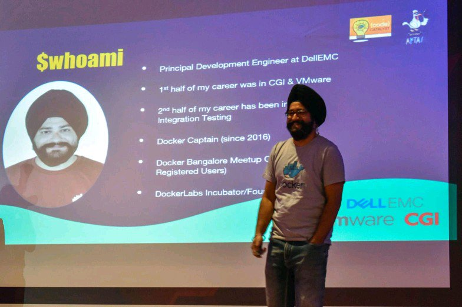

### Hi there 👋

<!--
**ajeetraina/ajeetraina** is a ✨ _special_ ✨ repository because its `README.md` (this file) appears on your GitHub profile.

Here are some ideas to get you started:

- 🔭 I’m currently working on ...
- 🌱 I’m currently learning ...
- 👯 I’m looking to collaborate on ...
- 🤔 I’m looking for help with ...
- 💬 Ask me about ...
- 📫 How to reach me: ...
- 😄 Pronouns: ...
- ⚡ Fun fact: ...
-->

- 🔭 [I’m a Docker Captain](https://www.docker.com/captains/ajeet-singh-raina)
- 🤔 I work for [Docker](https://www.docker.com/author/ajeet-singh-raina/) 
- 🌱 [I’m part of ARM Innovator programme](https://community.arm.com/innovation/b/blog/posts/arm-innovator-spotlight-ajeet-raina)
- 😄 [I'm a Docker Community Leader](https://www.docker.com/blog/2019-docker-community-awards/)
- 👯 I lead [Docker Bangalore Community](https://meetup.com/Docker-Bangalore) of 12,500+ members ...
- 💬 Ask me about [Docker](https://dockerlabs.collabnix.com), [Kubernetes](https://kubelabs.collabnix.com), [DevOps](https://collabnix.netlify.app/docs/devops/) and [IoT](https://github.com/collabnix/ioetplanet) 
- 📫 Join my personal [Collabnix Slack community](https://launchpass.com/collabnix) of 6000+ DevOps members 
- ⚡ I am a maintainer of [Docker Contribute Site](https://contribute.docker.com)
- 😄 I love blogging: https://www.collabnix.com
- 🌱 Bagged "Tip of Captain's Hat Award" in Dockercon 2019 San Francisco
- 🔭 Author at [TestProject Inc](https://blog.testproject.io/author/ajeetrainagmail-com/)
- ⚡ Community contributions  - [Docker](https://dockerlabs.collabnix.com), [KubeLabs](https://kubelabs.collabnix.com), [Kubetools](https://kubetools.collabnix.com)
- 👯 Subscribe to my Videos - [YouTube](https://youtube.com/c/Collabnix)

### Major Contributions/Initiatives

- 😄 [Docker Developer Community Site](https://dev.to/docker)
- 😄 [Author](https://docker.com/blog)
- 🌱 [DockerLabs](https://dockerlabs.collabnix.com)
- 🌱 [KubeLabs](https://kubelabs.collabnix.com)
- 🔭 [Kubetools](https://kubetools.collabnix.com)
- 🤔 [The Pico Project](https://github.com/collabnix/pico)
- 📫 [OpenUSM](https://github.com/collabnix/openusm)
- 📫 [Docker Community Extensions](https://github.com/collabnix/docker-community-extensions)
- 💬 [Redis Developer Hub](https://developer.redis.com)
- 🌱 [Docker + Wasm Resources](https://github.com/collabnix/wasm-docker-better-together)

### Follow me

- [LinkedIn](https://www.linkedin.com/in/ajeetsraina/)
- [Twitter](https://twitter.com/ajeetsraina)
- [Slack](https://launchpass.com/collabnix)
- [Website](https://www.collabnix.com)
- [Instagram](https://www.instagram.com/ajeetsraina/)
- [Facebook](https://www.facebook.com/ajeetraina)

### Latest Blogs(Collabnix)

- [Docker and Wasm Containers – Better Together](https://collabnix.com/docker-and-wasm-containers-better-together/)
- [Docker Dev Environments Explained in 5 Minutes](https://collabnix.com/docker-dev-environment-explained-in-5-minutes/)
- [Running MinIO using Docker Desktop in 5 Minutes](https://collabnix.com/running-minio-using-docker-desktop-in-5-minutes/)
- [Docker Desktop 4.13.0 introduces a New Dev Environment CLI for the first time](https://collabnix.com/docker-desktop-4-13-0-introduces-a-new-dev-environment-cli-for-the-first-time/)
- [Getting Started with Docker on Seeed Studio’s reComputer Powered by NVIDIA Jetson](https://collabnix.com/getting-started-with-docker-on-seeed-studios-recomputer-powered-by-nvidia-jetson/)
- [An Ultimate Curated List of Docker Extensions](https://collabnix.com/an-ultimate-curated-list-of-docker-desktop-extensions/)
- [Top 50 Essential Docker Developer Tools You Must be Aware Of (Docker](https://collabnix.com/top-50-essential-docker-developer-tools-you-must-be-aware-of/)
- [How to setup GPS Module with Raspberry Pi and perform Google Map Geo-Location Tracking in a Real-Time](https://collabnix.com/how-to-setup-gps-module-with-raspberry-pi-and-perform-google-map-geo-location-tracking-in-real-time/)
- [Top 5 Effective Discord Bot For Your Server in 2021](https://collabnix.com/top-5-effective-discord-bot-for-your-server-in-2021/)
- [How to build and run a Python app in a container – Docker Python Tutorial](https://collabnix.com/how-to-build-and-run-a-python-app-in-a-container/)
- [What is Kubernetes Scheduler and why do you need it? – KubeLabs Glossary](https://collabnix.com/what-is-kubernetes-scheduler-and-why-do-you-need-it-kubelabs-glossary/)
- [Running Automated Tasks with a CronJob over Kubernetes running on Docker Desktop 4.1.1](https://collabnix.com/running-automated-tasks-with-a-cronjob-over-kubernetes-running-on-docker-desktop-4-1-1/)
- [5 Best Redis Tutorials and Free Resources for all Levels](https://collabnix.com/top-5-redis-tutorials-and-resources-for-all-levels/)

### Latest Blog(Docker)

- [Build and Deploy a Retail Store Items Detection System Using No-Code AI Vision at the Edge](https://www.docker.com/blog/build-retail-store-items-detection-system-no-code-ai/)
- [Containerizing a Legendary PetClinic App Built with Spring Boot](https://www.docker.com/blog/containerizing-a-legendary-petclinic-app-built-with-spring-boot/)
- [How to Build and Deploy a Task Management Application Using Go](https://www.docker.com/blog/how-to-build-and-deploy-a-task-management-application-using-go/)
- [How to Build and Deploy a URL Shortener Using TypeScript and Nest.js](https://dockr.ly/3P7Ufxc)
- [9 Tips for Containerizing Your Spring Boot Code](https://dockr.ly/3QR2aR7)
- [How to Build and Deploy a Django-based URL Shortener App from Scratch](https://dockr.ly/3Rg0Rvi)
- [Building a Multi-Container .NET App Using Docker Desktop](https://www.docker.com/blog/building-multi-container-net-app-using-docker-desktop/)

### Medium

- [Popeye — A Kubernetes Cluster Sanitizer](https://medium.com/@ajeetsraina/popeye-a-kubernetes-cluster-sanitizer-1914723eb21d)
- [Hack into the DJI Robomaster S1 Battle Bot in 5 Minutes](https://medium.com/@ajeetsraina/hack-into-the-dji-robomaster-s1-battle-bot-in-5-minutes-collabnix-708da1ae262a)
- [Deploy your AWS EKS cluster with Terraform in 5 Minutes](https://medium.com/@ajeetsraina/deploy-your-aws-eks-cluster-with-terraform-in-5-minutes-collabnix-bc90a7a7c356)
- [Getting Started with Shipa](https://medium.com/@ajeetsraina/getting-started-with-shipa-2fc0fab44179)

### Blogs(Redis Developer Site)

- [Redis Enterprise Observability with Datadog](https://developer.redis.com/explore/datadog)
- [How to create Grafana Dashboards for Redis Enterprise cluster in 5 Minutes](https://developer.redis.com/explore/redisexplorer)
- [Utilize Elasticache Auto Discovery For Redis with RedisInsight](https://developer.redis.com/explore/redisinsight/autodiscover)
- [Deploy a NodeJS app on Heroku using Redis](https://developer.redis.com/create/heroku/herokunodejs)
- [Create Redis database on Docker](https://developer.redis.com/create/docker/)

### YouTube

- [How to Build an IoT Sensor Analytics using Docker, Redis and Grafana](https://www.youtube.com/watch?v=EGgFhpxx_Jk&t=105s)
- [Docker & Kubernetes on IoT Device](https://www.youtube.com/watch?v=d-VDbvAkWac&t=120s)
- [Deep Learning | Traffic | Docker | K3s | NVIDIA Jetson Nano | OpenDatacam](https://www.youtube.com/watch?v=eDVQgRN1FIY)
- [Quantifying your World with AI & Docker | Ajeet Raina | OSCONF Jaipur 2020 ](https://www.youtube.com/watch?v=1q-Y6WAtBxQ&t=1s)

### Events

[July 30 - Meetup #57 - Docker Developer Meetup at Harness.io](https://www.meetup.com/Docker-Bangalore/events/285342797/) - [Slides](https://github.com/collabnix/dockerbangalore/tree/master/slides/30July-DockerDeveloper-Harness) 
[June 11 - Meetup #56 - Docker Developer Meetup at Microsoft Reactor](https://www.meetup.com/Docker-Bangalore/events/285342797/) - [Slides](https://github.com/collabnix/dockerbangalore/tree/master/slides/11thJune-DockerDeveloper-MicrosoftReactor) 
[March 26th - Meetup #54 -  Docker 9th Birthday Celebration with JFrog Community ](https://www.meetup.com/Docker-Bangalore/events/284247414/) 
[June 2021 - Meetup #53 - A Joint Meetup with JFrog & Collabnix Community](https://events.docker.com/events/details/docker-bangalore-presents-docker-bangalore-joint-meetup-with-jfrog-collabnix-community/) - [Slides](./slides/19th-June-2021-53rd-DockerMeetup-JFrog/) 
[April 2021 - Meetup #52 - A Joint Meetup with Open Source Community Conference (OSCONF) 2021](https://events.docker.com/events/details/docker-bangalore-presents-a-joint-meetup-with-open-source-community-conference-osconf-2021-online-virtual-event/) 
[Jan 2021 - Meetup #51: Joint Meetup with Docker Malaysia & Docker Pune Group | Docker, DevOps and IoT ](https://events.docker.com/events/details/docker-bangalore-presents-meetup-51-joint-meetup-with-docker-malaysia-docker-pune-group-docker-devops-and-iot/) 
[18-Jan-2020 - #50 Kickstart Your 2020 Container Journey with Docker & Kubernetes + Kubernetes101 Workshop - SAP Labs](./slides/18th-Jan-2020-50th-Dockermeetup-SAPLabs) 
[23-Nov-2019 - #49 Docker, Kubernetes & DevOps Tools + Docker Intermediate Workshop](./slides/23rd-Nov-2019-Docker-k8s-monitoring-Dell-Meetup) 
[21-September 2019 - #48 Docker, K8s, ML + Docker101 Workshop - Amazon](https://events.docker.com/events/details/docker-bangalore-presents-docker-k8s-iot-mldl-docker101-hands-on-workshop-for-beginners/#/) 
[7-Septemeber-2019 - #46 Docker Bangalore Joint Meetup with Cloud Native Group of Bangalore](https://events.docker.com/events/details/docker-bangalore-presents-docker-bangalore-joint-meetup-with-cloud-native-group-of-bangalore/#/) 
[03rd August 2019 - #45 Docker, Kubernetes & IoT - WalmartLabs](./slides/3-Aug-2019-Docker_Kubernete_IoT_Machine-Learning/readme.md) 
[15th-June-2019 - #44 Dockercon 19 Recap & Announcements](./slides/15th-June-2019-Dockercon19-Recap/README.md) 
[25-April-2019 - #43 Docker Joint Meetup with OpenFaas @Microsoft Developer Group](./slides/2019-04-25-Joint-Meetup-OpenFaas-Microsoft-Developer-Group/README.md) 
[30-March-2019 - #42 Docker 6th Birthday Celeberation Event](./slides/2019-03-30-Docker-6th-Birthday-Show-n-Tell/README.md) 
[19-January-2019 - #41 Joint Meetup with Kubernetes & OpenShift + CloudNativeCon](./slides/2018-01-19-JointMeetup-Dockercon-Kubecon-Updates/README.md)

### [Join 7000+ DevOps Engineers today !](https://launchpass.com/collabnix)
