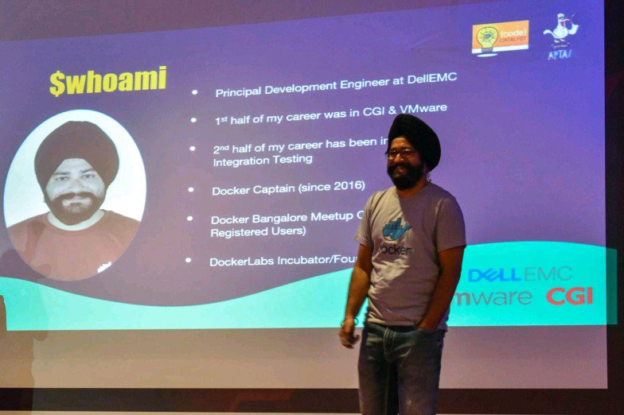

### Hi there 👋

<!--
**ajeetraina/ajeetraina** is a ✨ _special_ ✨ repository because its `README.md` (this file) appears on your GitHub profile.

Here are some ideas to get you started:

- 🔭 I’m currently working on ...
- 🌱 I’m currently learning ...
- 👯 I’m looking to collaborate on ...
- 🤔 I’m looking for help with ...
- 💬 Ask me about ...
- 📫 How to reach me: ...
- 😄 Pronouns: ...
- ⚡ Fun fact: ...
-->

- 🔭 [I’m a Docker Captain](https://www.docker.com/captains/ajeet-singh-raina)
- 🤔 I work for [Docker](https://www.docker.com/author/ajeet-singh-raina/) 
- 🌱 [I’m part of ARM Innovator programme](https://community.arm.com/innovation/b/blog/posts/arm-innovator-spotlight-ajeet-raina)
- 😄 [I'm a Docker Community Leader](https://www.docker.com/blog/2019-docker-community-awards/)
- 👯 I lead [Docker Bangalore Community](https://meetup.com/Docker-Bangalore) of 12,500+ members ...
- 💬 Ask me about [Docker](https://dockerlabs.collabnix.com), [Kubernetes](https://kubelabs.collabnix.com), [DevOps](https://collabnix.netlify.app/docs/devops/) and [IoT](https://github.com/collabnix/ioetplanet) 
- 📫 Join my personal [Collabnix Slack community](https://launchpass.com/collabnix) of 6000+ DevOps members 
- ⚡ I am a maintainer of [Docker Contribute Site](https://contribute.docker.com)
- 😄 I love blogging: https://www.collabnix.com
- 🌱 Bagged "Tip of Captain's Hat Award" in Dockercon 2019 San Francisco
- 🔭 Author at [TestProject Inc](https://blog.testproject.io/author/ajeetrainagmail-com/)
- ⚡ Community contributions  - [Docker](https://dockerlabs.collabnix.com), [KubeLabs](https://kubelabs.collabnix.com), [Kubetools](https://kubetools.collabnix.com)
- 👯 Subscribe to my Videos - [YouTube](https://youtube.com/c/Collabnix)

- 😄 [Docker Developer Community Site](https://dev.to/docker)
- 😄 [Author](https://docker.com/blog)
- 🌱 [DockerLabs](https://dockerlabs.collabnix.com)
- 🌱 [KubeLabs](https://kubelabs.collabnix.com)
- 🔭 [Kubetools](https://kubetools.collabnix.com)
- 🤔 [The Pico Project](https://github.com/collabnix/pico)
- 📫 [OpenUSM](https://github.com/collabnix/openusm)
- 📫 [Docker Community Extensions](https://github.com/collabnix/docker-community-extensions)
- 💬 [Redis Developer Hub](https://developer.redis.com)
- 🌱 [Docker + Wasm Resources](https://github.com/collabnix/wasm-docker-better-together)

### Follow me

- [LinkedIn](https://www.linkedin.com/in/ajeetsraina/)
- [Twitter](https://twitter.com/ajeetsraina)
- [Slack](https://launchpass.com/collabnix)
- [Community Website](https://www.collabnix.com)
- [Personal Website](https://ajeetraina.com)
- [Instagram](https://www.instagram.com/ajeetsraina/)
- [Facebook](https://www.facebook.com/ajeetraina)

### Latest Blogs (ajeetraina.com)

<!-- BLOG-POST-LIST:START -->
- [Docker Whaleness Day: A Small Pause That Makes a Big Difference](https://www.ajeetraina.com/docker-whaleness-day-a-small-pause-that-makes-a-big-difference/)
- [Deep dive: agent skills in Docker Sandboxes](https://www.ajeetraina.com/deep-dive-agent-skills-in-docker-sandboxes/)
- [Best Practices for Sandboxing Agents and Kits](https://www.ajeetraina.com/best-practices-for-sandboxing-agents-and-kits/)
- [What's New in Docker Sandboxes (sbx) 0.35.0](https://www.ajeetraina.com/whats-new-in-docker-sandboxes-sbx-0-35-0/)
- [Inside Docker Model Runner: one API, three inference engines](https://www.ajeetraina.com/inside-docker-model-runner-one-api-three-inference-engines/)
- [Run Visual Studio Code and Claude Code Inside a Docker Sandbox microVM](https://www.ajeetraina.com/run-visual-studio-code-and-claude-code-inside-a-docker-sandbox-microvm/)
- [SSH Straight Into Your Agent Sandboxes: A Hands-On Look at `sbx ssh`](https://www.ajeetraina.com/ssh-straight-into-your-agent-sandboxes-a-hands-on-look-at-sbx-ssh/)
- [Collabnix AI Weekly - June 2026 Edition](https://www.ajeetraina.com/collabnix-ai-weekly-june-2026-edition/)
- [Running Coding Agents in a Secure MicroVM on Windows with sbx](https://www.ajeetraina.com/running-coding-agents-in-a-secure-microvm-on-windows-with-sbx/)
- [1Password + Docker Sandboxes: Keeping Secrets Out of the Box](https://www.ajeetraina.com/securing-docker-sandboxes-a-quick-look-at-1password-credential-injection/)
- [How Docker Is Solving the AI Governance Problem](https://www.ajeetraina.com/how-docker-is-solving-the-ai-governance-problem/)
- [Getting Started with the Pi Agent Kit on Docker Sandboxes](https://www.ajeetraina.com/getting-started-with-the-pi-agent-kit-on-docker-sandboxes/)
- [Claude Code in a Docker Sandbox: How Kits Make It Shareable and Secure](https://www.ajeetraina.com/claude-code-in-a-docker-sandbox-how-kits-make-it-shareable-and-secure/)
- [10 Things You Must Know About Docker Sandboxes](https://www.ajeetraina.com/10-things-you-must-know-about-docker-sandboxes/)
- [Running Docker Agent Inside a Sandbox](https://www.ajeetraina.com/running-docker-agent-inside-a-sandbox/)
<!-- BLOG-POST-LIST:END -->

### Latest Blog(Docker)

<!-- DOCKER-POST-LIST:START -->
- [Coding Agent Horror Stories: The 29 Million Secret Problem](https://www.docker.com/blog/coding-agent-horror-stories-the-29-million-secret-problem/)
- [Coding Agent Horror Stories: The Agent That Deleted Production](https://www.docker.com/blog/coding-agent-horror-stories-the-agent-that-deleted-production/)
- [Coding Agent Horror Stories: The rm -rf ~/ Incident](https://www.docker.com/blog/coding-agent-horror-stories-the-rm-rf-incident/)
- [Coding Agent Horror Stories: The Security Crisis Threatening Developer Infrastructure](https://www.docker.com/blog/ai-coding-agent-horror-stories-security-risks/)
- [From Security Blocked to Prod Ready: ClickHouse on Docker Hardened Images](https://www.docker.com/blog/from-security-blocked-to-prod-ready-clickhouse-on-docker-hardened-images/)
- [How to Analyze Hugging Face for Arm64 Readiness](https://www.docker.com/blog/how-to-analyze-hugging-face-for-arm64-readiness/)
- [How Medplum Secured Their Healthcare Platform with Docker Hardened Images (DHI)](https://www.docker.com/blog/medplum-healthcare-docker-hardened-images/)
- [The Multi-Model Database for AI Agents: Deploy SurrealDB with Docker Extension](https://www.docker.com/blog/deploy-surrealdb-docker-desktop-extension/)
- [How to Automate Arm Migration with Docker MCP Toolkit, VS Code, and GitHub Copilot](https://www.docker.com/blog/automate-arm-migration-docker-mcp-copilot/)
- [How to Add MCP Servers to ChatGPT with Docker MCP Toolkit](https://www.docker.com/blog/add-mcp-server-to-chatgpt/)
- [From Compose to Kubernetes to Cloud: Designing and Operating Infrastructure with Kanvas](https://www.docker.com/blog/compose-to-kubernetes-to-cloud-kanvas/)
- [MCP Horror Stories: The WhatsApp Data Exfiltration Attack](https://www.docker.com/blog/mcp-horror-stories-whatsapp-data-exfiltration-issue/)
- [How to add MCP Servers to Claude Desktop with Docker MCP Toolkit](https://www.docker.com/blog/connect-mcp-servers-to-claude-desktop-with-mcp-toolkit/)
<!-- DOCKER-POST-LIST:END -->

### Medium

- [Popeye — A Kubernetes Cluster Sanitizer](https://medium.com/@ajeetsraina/popeye-a-kubernetes-cluster-sanitizer-1914723eb21d)
- [Hack into the DJI Robomaster S1 Battle Bot in 5 Minutes](https://medium.com/@ajeetsraina/hack-into-the-dji-robomaster-s1-battle-bot-in-5-minutes-collabnix-708da1ae262a)
- [Deploy your AWS EKS cluster with Terraform in 5 Minutes](https://medium.com/@ajeetsraina/deploy-your-aws-eks-cluster-with-terraform-in-5-minutes-collabnix-bc90a7a7c356)
- [Getting Started with Shipa](https://medium.com/@ajeetsraina/getting-started-with-shipa-2fc0fab44179)

### Blogs(Redis Developer Site)

- [Redis Enterprise Observability with Datadog](https://developer.redis.com/explore/datadog)
- [How to create Grafana Dashboards for Redis Enterprise cluster in 5 Minutes](https://developer.redis.com/explore/redisexplorer)
- [Utilize Elasticache Auto Discovery For Redis with RedisInsight](https://developer.redis.com/explore/redisinsight/autodiscover)
- [Deploy a NodeJS app on Heroku using Redis](https://developer.redis.com/create/heroku/herokunodejs)
- [Create Redis database on Docker](https://developer.redis.com/create/docker/)

### YouTube

- [How to Build an IoT Sensor Analytics using Docker, Redis and Grafana](https://www.youtube.com/watch?v=EGgFhpxx_Jk&t=105s)
- [Docker & Kubernetes on IoT Device](https://www.youtube.com/watch?v=d-VDbvAkWac&t=120s)
- [Deep Learning | Traffic | Docker | K3s | NVIDIA Jetson Nano | OpenDatacam](https://www.youtube.com/watch?v=eDVQgRN1FIY)
- [Quantifying your World with AI & Docker | Ajeet Raina | OSCONF Jaipur 2020 ](https://www.youtube.com/watch?v=1q-Y6WAtBxQ&t=1s)

### Events

[July 30 - Meetup #57 - Docker Developer Meetup at Harness.io](https://www.meetup.com/Docker-Bangalore/events/285342797/) - [Slides](https://github.com/collabnix/dockerbangalore/tree/master/slides/30July-DockerDeveloper-Harness) 
[June 11 - Meetup #56 - Docker Developer Meetup at Microsoft Reactor](https://www.meetup.com/Docker-Bangalore/events/285342797/) - [Slides](https://github.com/collabnix/dockerbangalore/tree/master/slides/11thJune-DockerDeveloper-MicrosoftReactor) 
[March 26th - Meetup #54 -  Docker 9th Birthday Celebration with JFrog Community ](https://www.meetup.com/Docker-Bangalore/events/284247414/) 
[June 2021 - Meetup #53 - A Joint Meetup with JFrog & Collabnix Community](https://events.docker.com/events/details/docker-bangalore-presents-docker-bangalore-joint-meetup-with-jfrog-collabnix-community/) - [Slides](./slides/19th-June-2021-53rd-DockerMeetup-JFrog/) 
[April 2021 - Meetup #52 - A Joint Meetup with Open Source Community Conference (OSCONF) 2021](https://events.docker.com/events/details/docker-bangalore-presents-a-joint-meetup-with-open-source-community-conference-osconf-2021-online-virtual-event/) 
[Jan 2021 - Meetup #51: Joint Meetup with Docker Malaysia & Docker Pune Group | Docker, DevOps and IoT ](https://events.docker.com/events/details/docker-bangalore-presents-meetup-51-joint-meetup-with-docker-malaysia-docker-pune-group-docker-devops-and-iot/) 
[18-Jan-2020 - #50 Kickstart Your 2020 Container Journey with Docker & Kubernetes + Kubernetes101 Workshop - SAP Labs](./slides/18th-Jan-2020-50th-Dockermeetup-SAPLabs) 
[23-Nov-2019 - #49 Docker, Kubernetes & DevOps Tools + Docker Intermediate Workshop](./slides/23rd-Nov-2019-Docker-k8s-monitoring-Dell-Meetup) 
[21-September 2019 - #48 Docker, K8s, ML + Docker101 Workshop - Amazon](https://events.docker.com/events/details/docker-bangalore-presents-docker-k8s-iot-mldl-docker101-hands-on-workshop-for-beginners/#/) 
[7-Septemeber-2019 - #46 Docker Bangalore Joint Meetup with Cloud Native Group of Bangalore](https://events.docker.com/events/details/docker-bangalore-presents-docker-bangalore-joint-meetup-with-cloud-native-group-of-bangalore/#/) 
[03rd August 2019 - #45 Docker, Kubernetes & IoT - WalmartLabs](./slides/3-Aug-2019-Docker_Kubernete_IoT_Machine-Learning/readme.md) 
[15th-June-2019 - #44 Dockercon 19 Recap & Announcements](./slides/15th-June-2019-Dockercon19-Recap/README.md) 
[25-April-2019 - #43 Docker Joint Meetup with OpenFaas @Microsoft Developer Group](./slides/2019-04-25-Joint-Meetup-OpenFaas-Microsoft-Developer-Group/README.md) 
[30-March-2019 - #42 Docker 6th Birthday Celeberation Event](./slides/2019-03-30-Docker-6th-Birthday-Show-n-Tell/README.md) 
[19-January-2019 - #41 Joint Meetup with Kubernetes & OpenShift + CloudNativeCon](./slides/2018-01-19-JointMeetup-Dockercon-Kubecon-Updates/README.md)

### [Join 11000+ DevOps Engineers today !](https://launchpass.com/collabnix)
